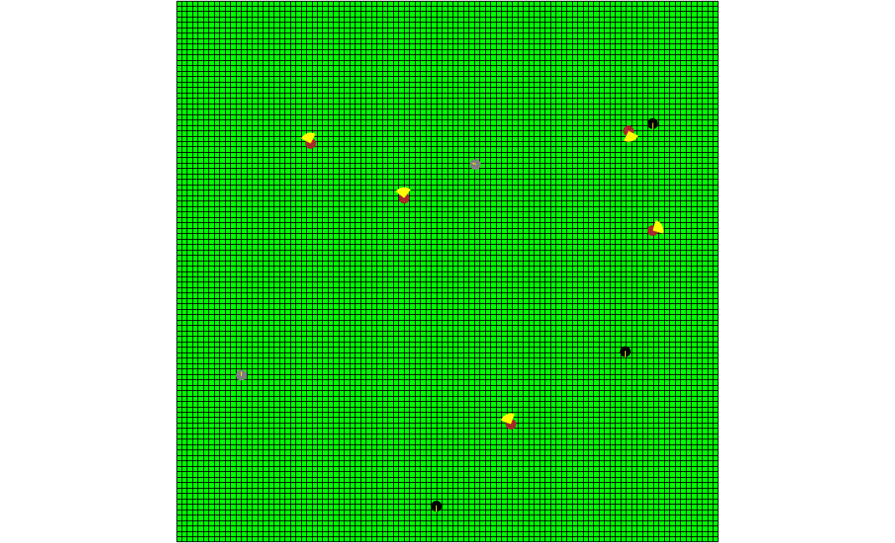
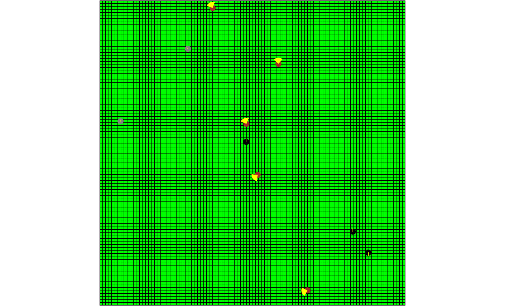

## Exploring movements and action neighborhoods in GAML
### Introduction
The aim of this experiment is to explore the different types of movements and action neighborhoods in GAML. 
Movements are a ‘skill’ given to agents, and action neighborhoods are visual elements that can be displayed in the map that show the area where agents can move to.
### Methods
In this model there are 5 cow agents, 3 sheep, and 2 goats with speeds of 2.0, 1.0, and 0.5, respectively. 
```java
init {
  create cows number:5 {
    speed <- 2.0;
  }
  create sheep number:3 {
    speed <- 1.0;
    heading <- 90.0;
  }
  create goats number:2 {
    speed <- 0.5;
  }
}
```
Each species performs a specific movement using built-in actions, such as wander for cows, move for sheep, and goto for goats.
```java
// cows
do wander amplitude: 90.0;
```
```java
// sheep
do move;
```
```java
// goats
do goto target: {0,0};
```
To display the action neighborhoods, circle and line geometries were used.
```java
// cows
action_area <- circle(speed) intersection cone(heading - 45, heading + 45);
```
```java
// sheep
if (heading > 90) {
  action_area <- line(self.location, self.location + {0,-1});
}
else {
  action_area <- line(self.location, self.location + {0,1});
}
```
```java
// goats
action_area <- line(self.location, {0,0})intersection circle(speed);
```
### Results
<div style="flex">


</div>
&nbsp;&nbsp;&nbsp;&nbsp;&nbsp;&nbsp;Figure 1. Map in cycle 1 (Left) and map in cycle 60 (Right).
<br />
<br />
As shown in Fig. 1, the brown cow agents perform a random wander movement withing the given 90 degrees angle 
(yellow cones). Black sheep, however, perform a move to south movement, and goats goto the origin of the map with coordinates {0,0}. 
### Discussion
Movements and action neighborhoods are an important tool in spatial simulation for demonstrating agent movements in space, and studying their behavior.
