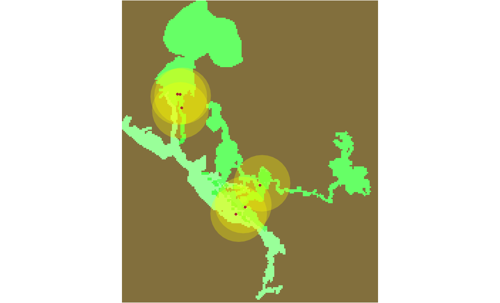

## Grazing Cows Simulation
### Introduction
The aim of this exercise is to create a spatial representation of grazing of cows in Vierkaser and simulate the results.
### Methods
For this type of model spatial interaction of agents is key. Thus, geometric shapes of the investigated grassland were implemented using file variables 
```java
file vierkaser_file <- file("../includes/Vierkaser.geojson");
file cleaned_2020_file <- file("../includes/cleaned_2020.geojson");
file cleaned_2021_file <- file("../includes/cleaned_2021.geojson");
file cleaned_2022_file <- file("../includes/cleaned_2022.geojson");
file cleaned_2023_file <- file("../includes/cleaned_2023.geojson");
file hirschanger_file <- file("../includes/Hirschanger.geojson");
file meadow_file <- file("../includes/Meadow.geojson");

geometry shape <- envelope(vierkaser_file);
geometry cleaned_2020 <- geometry(cleaned_2020_file);
geometry cleaned_2021 <- geometry(cleaned_2021_file);
geometry cleaned_2022 <- geometry(cleaned_2022_file);
geometry cleaned_2023 <- geometry(cleaned_2023_file);
geometry hirschanger <- geometry(hirschanger_file);
geometry meadow <- geometry(meadow_file);
```
Six cow agents were initiated with a ‘graze’ reflex. Using this reflex, agents can identify a location in the grid with enough biomass to graze. Once found, they move to the target and ‘ask’ biomass to decrease 
```java
reflex graze {
  grass_within_area <- grass intersecting(action_area); // gets every grass within action area
  loop i from: 0 to: (length(grass_within_area)-1){ // finds the first eligible grass, e.g. best spot
    ask grass_within_area[i] { 
      if biomass >= 0.4 {
        myself.best_spot <- myself.grass_within_area[i];
        i <- length(myself.grass_within_area)-1;
      }
    }
  }
  do goto target: best_spot; // goes to best spot
  grass_within_reach <- grass intersecting(circle(3)); // gets grass that are within reach
  loop i from: 0 to: (length(grass_within_reach)-1){ // loops through the grass within reach
    ask grass_within_reach[i] { // asks the grass to lose biomass if over 0.4
      if biomass >= 0.4{
        biomass <- biomass - 0.4;
      }
    }
  }
}
```
The ‘grass’ grid will gradually increase its biomass depending on the area 
```java
reflex grow {
  if biomass <= 0.7 and is_cleaned_2020 {
    biomass <- biomass + grow_rate;
  }
  if biomass <= 0.6 and is_cleaned_2021_2023 {
    biomass <- biomass + grow_rate;
  }
  if biomass <= 0.4 and is_hirschanger {
    biomass <- biomass + grow_rate;
  }
  if biomass <= 0.6 and is_meadow {
    biomass <- biomass + grow_rate;
  }
}
```
### Results
a) \
b) \
c) \
&nbsp;&nbsp;&nbsp;&nbsp;&nbsp;&nbsp;Figure 1. Simulation snapshots. (a) cycle 1, (b) cycle 146, (c) cycle 469.\
\
According to the results of the simulation (see Fig. 1), the cows quickly spread out across the grassland. As they do, the reduced biomass recovers over time, and cows don’t run out of grass.
### Discussion
This experiment was an introduction to spatial interactions of agents in GAML. The most important parameters of the model were the radius of action area and biomass growth rate.
