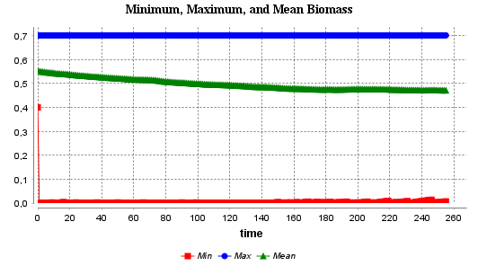
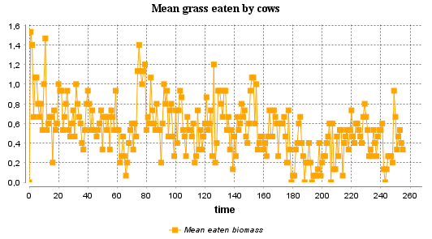
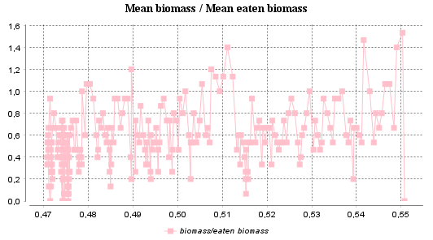

# Visualization and Data Export
## Introduction
The aim of this week’s exercise is to learn how to create charts and plots and save results data. 
## Methods
To display charts in the output, three displays were added 
```java
display chart0 background: #white {
  chart 'Minimum, Maximum, and Mean Biomass' type: series {
    data 'Min' value: min(grassland_biomass) color: #red;
    data 'Max' value: max(grassland_biomass) color: #blue;
    data 'Mean' value: mean(grassland_biomass) color: #green;
  }
}
display chart1 background: #white {
  chart 'Mean grass eaten by cows' type: series {
    data 'Mean eaten biomass' value: mean_eaten_biomass color: #orange;
  }
}
display chart2 background: #white {
  chart 'Mean biomass / Mean eaten biomass' type: xy {
    data 'biomass/eaten biomass' value: {mean(grassland_biomass), mean_eaten_biomass} color: #pink;
  }
}
```
To track the biomass only on the grassland cells, grassland_biomass variable was created 
```java
list<float> grassland_biomass <- [];
```
```java
reflex grow {
  if biomass <= 0.7 and is_cleaned_2020 {
    biomass <- biomass + grow_rate;
    grassland_biomass[index_of_biomass] <- biomass;
  }
  if biomass <= 0.6 and is_cleaned_2021_2023 {
    biomass <- biomass + grow_rate;
    grassland_biomass[index_of_biomass] <- biomass;
  }
  if biomass <= 0.4 and is_hirschanger {
    biomass <- biomass + grow_rate;
    grassland_biomass[index_of_biomass] <- biomass;
  }
  if biomass <= 0.6 and is_meadow {
    biomass <- biomass + grow_rate;
    grassland_biomass[index_of_biomass] <- biomass;
  }
}
```
For tracking eaten biomass reset_eaten_biomass variable was created, which is used to calculate the mean during last cow's actions 
```java
reflex calculate_mean_eaten_biomass {
  if index = 5 {
    mean_eaten_biomass <- eaten_biomass/6;
  }
}
```
## Results
\
&nbsp;&nbsp;&nbsp;&nbsp;&nbsp;&nbsp; Figure 1. Minimum, maximum, and mean biomass.\
\
\
&nbsp;&nbsp;&nbsp;&nbsp;&nbsp;&nbsp; Figure 2. Mean eaten grass by cows.\
\
\
&nbsp;&nbsp;&nbsp;&nbsp;&nbsp;&nbsp; Figure 3. Mean biomass over mean eaten biomass.\
\
As seen in Fig. 1, Fig. 2, and Fig. 3 the charts were successfully generated and visualize the data accordingly.
## Discussion
With the help GAMA visualization tools, it is now clear that the system reaches an equilibrium state, where the biomass stays at the level of slightly lower than 0.5 (Figure 1). The minimum biomass crows can graze is equal to 0.4. This also explains why there are many concentrated points around 0.47 in Figure 3. 
